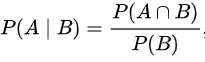
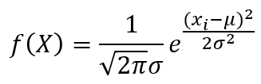

# Bayesian Network Classification
This program is to classify types of memberships via Bayesian Network.
The conditional probability takes important roles in output decision. 

## Data Preparation 

For Discrete data, using the equation below,



For Continuous data, using the equation(normal probability distribution) below,  



Finally, the decision will be depened on the formula below,


 
 ```
  C = Class Value for Instance
  A = Instance's attributes
  ```   
  
## Environment Requirement
* Programing - c++ (MinGW.org GCC-6.3.0-1)
* OS - Linux(bash), Windows10

## How to complie the program ?

* Linux(Recommend)
  If you use linux to compile the program, just type **make all** in the terminal 
  ```
  $make all
  ```
* Windows
  If use Window, please follow this command below
  ```
  $ g++ hw3.cpp -o hw3
  ```

## Let run the program !
Type the following commands for both cases. 
* Linux
  ```
  $ ./hw3 
  ```
* Windows
  ```
  $ hw3.exe 
  ```
## Output
  See the classification output at `output.txt` after the execution. 
